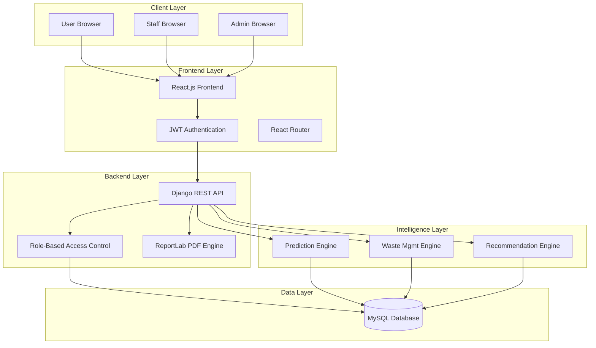
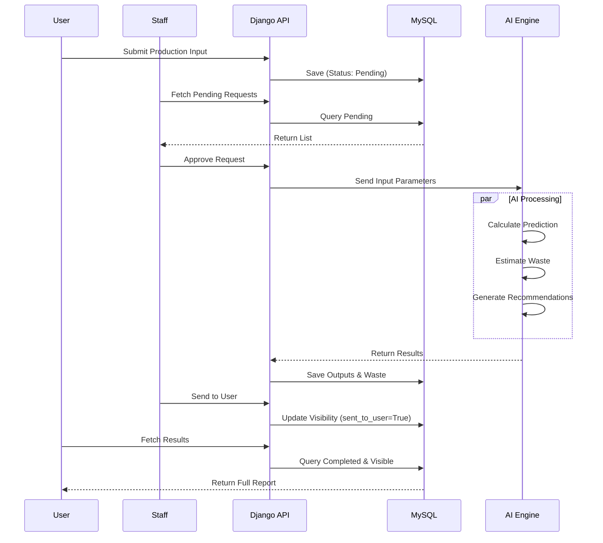

# AluOptimize – AI-Driven Aluminum Production Optimization Platform

---

## 🧠 AluOptimize - Internship Project

### 👨‍💻 Developer Information
**Developed by:** Mukarram Bambot  
**Role:** Python Full Stack Developer Intern  
**Company:** VCodez - Innovating Ideas

### 📖 Description
AluOptimize is a full-stack web application developed as part of a Python Full Stack Development internship at VCodez - Innovating Ideas. The project focuses on optimizing aluminum production using predictive analysis, waste management, and AI-driven recommendations.

---

## 🌐 Overview

**AluOptimize** is a cutting-edge industrial optimization platform designed specifically for the aluminum manufacturing sector. It leverages advanced predictive modeling and reinforcement learning concepts to analyze production parameters, forecast outputs, and recommend waste reduction strategies.

### Why it was built
The aluminum production process is energy-intensive and complex, often resulting in significant waste and variable efficiency. Traditional monitoring methods are reactive rather than proactive. AluOptimize was built to bridge this gap by providing **predictive insights** and **actionable recommendations** before inefficiencies occur.

### What problems it solves
- **Energy Inefficiency:** Identifies optimal parameters to reduce power consumption.
- **Production Waste:** Forecasts waste generation and suggests reuse strategies.
- **Quality Variability:** Predicts output quality based on input parameters.
- **Data Silos:** Centralizes production data for users, staff, and administrators.

### Real-world Use Cases
- **Plant Operators:** Can simulate production runs to see expected outcomes before committing resources.
- **Sustainability Managers:** Can track waste generation trends and implement AI-suggested recycling methods.
- **Process Engineers:** Can analyze historical data to fine-tune feed rates, temperatures, and bath ratios for maximum efficiency.

---

## 🔄 Complete System Workflow

The system follows a strict **User → Staff → Admin** hierarchy to ensure data integrity and validation.

### Step-by-Step Functional Flow

1.  **User Submission**
    *   User logs in to the **User Dashboard**.
    *   Submits a **Production Input** form (Feed Rate, Temperature, Pressure, etc.).
    *   System saves the record with status **"Pending"**.
    *   User sees the submission in their history but cannot see results yet.

2.  **Staff Processing**
    *   Staff logs in to the **Staff Dashboard**.
    *   Receives notification of new pending requests.
    *   Reviews the input parameters.
    *   Clicks **"Approve & Calculate"**.

3.  **AI Engine Execution**
    *   The system automatically triggers the **Prediction Engine**.
    *   **Generates Production Output:** Predicted mass, energy efficiency, quality score.
    *   **Generates Waste Management:** Estimated waste amount, type, and reusability.
    *   **Generates Recommendations:** AI-driven suggestions for optimization (e.g., "Reduce temperature by 5°C to save 2% energy").

4.  **Result Delivery**
    *   Staff reviews the generated results.
    *   Clicks **"Send to User"**.
    *   System updates the record status to **"Completed"** and flags it as visible to the user.

5.  **User Insights**
    *   User receives a notification.
    *   Dashboard updates to show **Predictions**, **Waste Data**, and **Recommendations**.
    *   User can download a detailed **PDF Report**.

6.  **Admin Oversight**
    *   Admin logs in to the **Admin Dashboard**.
    *   Monitors global metrics: Total Production, Average Efficiency, Total Waste.
    *   Manages all users and staff accounts.
    *   Accesses system-wide reports and logs.

---

## 🏗️ System Architecture

### High-Level Architecture



### Data Pipeline Flow



---

## ✨ Features List

### 👤 User Features
*   **Dashboard:** Real-time overview of recent activities and stats.
*   **Input Submission:** Detailed form for submitting production parameters.
*   **Prediction History:** View past predictions with status indicators.
*   **Waste Insights:** Access to waste generation data and reuse potential.
*   **AI Recommendations:** Actionable tips to improve future production runs.
*   **PDF Reports:** Download comprehensive reports for each submission.

### 👔 Staff Features
*   **Staff Panel:** Central hub for managing pending user requests.
*   **Approval Workflow:** Review, approve, or reject user submissions.
*   **AI Calculation:** Trigger the backend engines to generate predictions.
*   **User Management:** View and manage standard user accounts.
*   **Report Generation:** Generate and email PDF reports directly to users.
*   **Analytics:** View aggregate stats on production efficiency.

### 🛡️ Admin Features
*   **Global Dashboard:** High-level metrics (Total Users, Efficiency Trends, Waste Stats).
*   **Full System Access:** View all data across the platform.
*   **User & Staff Management:** Create, edit, deactivate, and promote users/staff.
*   **System Configuration:** Manage global settings and parameters.
*   **Audit Logs:** Track system usage and performance.

---

## 🛠️ Tech Stack

### Frontend
*   **Framework:** React.js (v18+)
*   **UI Library:** Material UI (MUI)
*   **HTTP Client:** Axios
*   **State Management:** React Context API
*   **Authentication:** JWT (JSON Web Tokens)
*   **Routing:** React Router v6
*   **Charts:** Recharts / Chart.js

### Backend
*   **Framework:** Django (Python)
*   **API:** Django REST Framework (DRF)
*   **Database:** MySQL
*   **Authentication:** Simple JWT
*   **PDF Generation:** ReportLab
*   **Email:** Django Core Mail

### Intelligence & Logic
*   **Predictive Modeling:** Custom logic for output forecasting.
*   **Waste Optimization:** Rule-based waste estimation.
*   **Recommendation Engine:** Heuristic-based suggestion system.

---

## 📥 Installation Guide

### Prerequisites
*   Python 3.8+
*   Node.js 16+
*   MySQL Server

### A. Backend Setup (Django)

1.  **Clone the repository:**
    ```bash
    git clone https://github.com/your-repo/AluOptimize.git
    cd AluOptimize/backend
    ```

2.  **Create and activate virtual environment:**
    ```bash
    # Linux/Mac
    python3 -m venv venv
    source venv/bin/activate
    
    # Windows
    python -m venv venv
    venv\Scripts\activate
    ```

3.  **Install dependencies:**
    ```bash
    pip install -r requirements.txt
    ```

4.  **Configure Database:**
    *   Create a MySQL database named `aluoptimize_db`.
    *   Update `settings.py` with your MySQL credentials.

5.  **Run Migrations:**
    ```bash
    python manage.py makemigrations
    python manage.py migrate
    ```

6.  **Create Superuser:**
    ```bash
    python manage.py createsuperuser
    ```

7.  **Run Server:**
    ```bash
    python manage.py runserver
    ```

### B. Frontend Setup (React)

1.  **Navigate to frontend directory:**
    ```bash
    cd ../frontend
    ```

2.  **Install dependencies:**
    ```bash
    npm install
    ```

3.  **Start Development Server:**
    ```bash
    npm start
    ```

### C. Running Both Together

*   Ensure MySQL is running.
*   Start Django backend on port `8000`.
*   Start React frontend on port `3000`.
*   Access the application at `http://localhost:3000`.

---

## 🔗 Login URLs

| Role | URL Path | Description |
|------|----------|-------------|
| **User** | `/login` | Standard user access |
| **Staff** | `/stafflogin` | Staff dashboard access |
| **Admin** | `/adminlogin` | Administrator access |
| **Super Admin** | `/admin` | Django built-in admin panel |

---

## 📂 Folder Structure

```
AluOptimize/
├── backend/
│   ├── apps/
│   │   ├── accounts/       # User authentication & profiles
│   │   ├── core/           # Core views & utilities
│   │   ├── prediction/     # Prediction engine logic
│   │   ├── waste/          # Waste management logic
│   ├── aluoptimize/        # Project settings
│   ├── manage.py
│   └── requirements.txt
│
├── frontend/
│   ├── public/
│   ├── src/
│   │   ├── components/     # Reusable UI components
│   │   ├── context/        # Auth & Theme context
│   │   ├── pages/          # Main page views
│   │   ├── services/       # API service calls
│   │   └── App.js
│   └── package.json
```

---

## 📚 API Documentation

### Auth Endpoints
*   `POST /api/auth/token/` - Obtain JWT Pair
*   `POST /api/auth/token/refresh/` - Refresh Access Token
*   `POST /api/accounts/register/` - Register New User

### User Endpoints
*   `POST /api/prediction/submit/` - Submit Production Input
*   `GET /api/prediction/history/` - Get User History
*   `GET /api/waste/my-waste/` - Get User Waste Data

### Staff Endpoints
*   `GET /api/staff/dashboard/` - Staff Dashboard Stats
*   `POST /api/prediction/approve/{id}/` - Approve & Calculate
*   `POST /api/staff/input-reports/generate/` - Generate PDF Report

### Admin Endpoints
*   `GET /api/admin-panel/dashboard/` - Global Stats
*   `GET /api/admin-panel/users/` - Manage All Users

---

## 📸 Screenshots

### 📸 Dashboard Screenshot
User Dashboard showing prediction history and charts.

[](https://github.com/MukarramBambot/AluOptimize/blob/main/assets/screenshots/UserDB.png)

### 📸 Staff Panel Screenshot
Staff Panel showing pending requests and approval workflow.

[](https://github.com/MukarramBambot/AluOptimize/blob/main/assets/screenshots/StaffD.png)

### 📸 Admin Panel Screenshot
Admin Panel with global metrics and system management.

[](https://github.com/MukarramBambot/AluOptimize/blob/main/assets/screenshots/AdminD.png)

### 📄 Generated PDF Report Screenshot
Generated PDF report with tables, predictions, and recommendations.

[](https://github.com/MukarramBambot/AluOptimize/blob/main/assets/screenshots/PDF.png)

### 🎥 Demo Walkthrough Video
Watch a complete walkthrough of the AluOptimize platform.

[📹 Demo Walkthrough Video](https://github.com/MukarramBambot/AluOptimize/blob/main/assets/demo/demo%20walkthrough%20video.mp4)

### 📄 Sample Generated PDF File
Download a sample PDF report generated by the system.

[📥 Sample Generated PDF Report](https://github.com/MukarramBambot/AluOptimize/blob/main/assets/generated-pdfs/aluoptimize_report_input.pdf)

---

## 📞 Contact Information

**📧 Email:** mukbambot118@gmail.com  
**📱 WhatsApp:** +91 8925769787  
**🔗 LinkedIn:** [www.linkedin.com/in/mukarrambambot](https://www.linkedin.com/in/mukarrambambot)

---

## 📄 License

**Private — For Internship Use Only**  
This project is developed for educational and internship purposes at VCodez. Unauthorized reproduction or distribution is prohibited.
